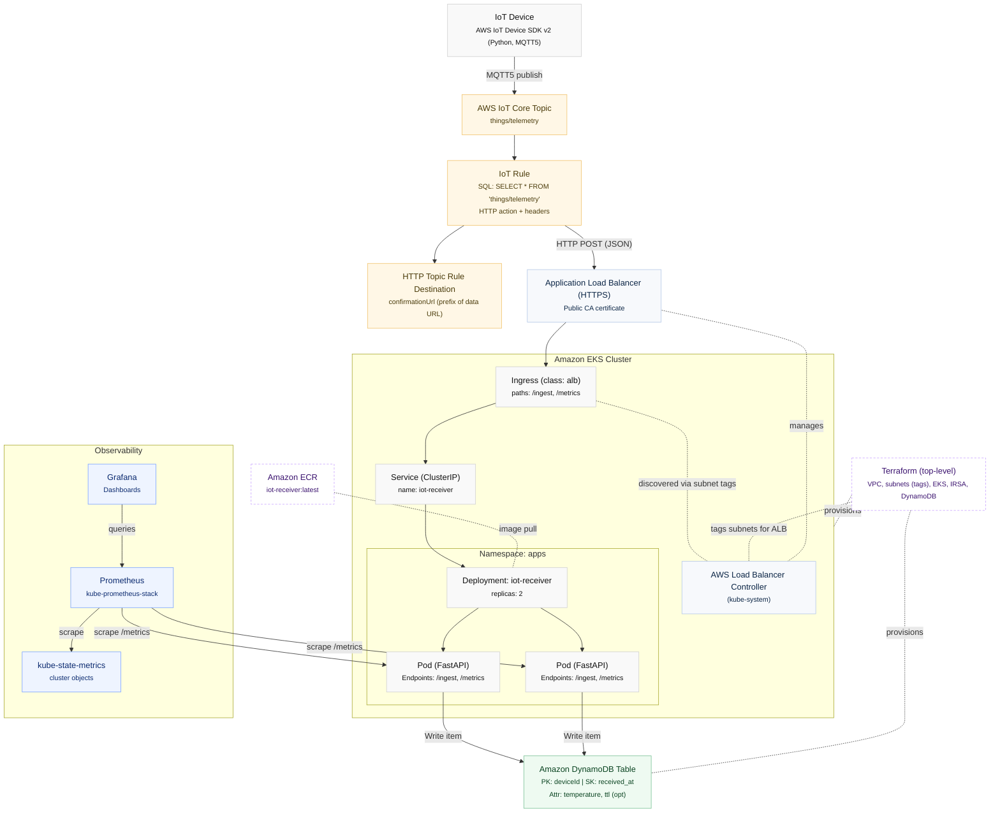

# IoT Web App (FastAPI + AWS IoT Device SDK v2 + IoT Rule HTTP → ALB)

This project demonstrates an end-to-end path where a device (or simulator) uses the **AWS IoT Device SDK v2 for Python** to publish MQTT messages to **AWS IoT Core**. An **AWS IoT Rule** then forwards those messages via the **HTTP rule action** to an **HTTPS endpoint** on your **Application Load Balancer (ALB)**. The FastAPI app receives the POSTs and writes one row per message to **DynamoDB**. 


## Architecture



- **Device publish (MQTT5)**  
  I use the **AWS IoT Device SDK v2 for Python** to publish telemetry (e.g., `{ deviceId, temp, ts }`) to a topic. The SDK v2 supports MQTT5 and includes ready-to-run samples.

- **IoT Rule → HTTP (to ALB)**  
  I configure an **AWS IoT Rule** with `SELECT * FROM 'TOPIC'` to forward the **entire JSON payload** via the **HTTP rule action** to my **HTTPS ALB endpoint**.

- **Destination confirmation (required once)**  
  I create and confirm an **HTTP Topic Rule Destination**: IoT Core POSTs a confirmation to my `confirmationUrl`, I confirm/enable it, and then traffic flows to my data URL.

- **TLS (ALB cert)**  
  My ALB presents a certificate from a **supported public CA**; **self-signed certs aren’t accepted** for IoT HTTP destinations.

- **API behind ALB (FastAPI) — two “virtual directories”**  
  - **`/metrics`** — a lightweight health endpoint used by the ALB target-group health checks. It returns **HTTP 200** quickly; in my Ingress I set the annotation `alb.ingress.kubernetes.io/healthcheck-path: /metrics`.  
  - **`/ingest`** — receives **HTTP POST** from the IoT Rule. The app validates a shared secret header and **accepts only** JSON that meets my criteria (e.g., `deviceId: string`, `temp: number`, optional `ts`). On success, it writes a row to DynamoDB.

- **DynamoDB table (my schema)**  
  I key the table by **`deviceId`** and store the **time of receipt** and **temperature**.  
  Recommended shape (so I can support many readings per device and time-range queries):
  - **Partition key**: `deviceId` (String)  
  - **Sort key**: `Time` (String)  
  - Attributes: `temperature` (Number)
  This uses DynamoDB’s **composite primary key** model (partition + sort key) and **TTL** for lifecycle.

- **Ingress on EKS via AWS Load Balancer Controller**  
  I use the **AWS Load Balancer Controller (LBC)** to provision an **ALB** from my Kubernetes **Ingress** manifest and map the paths `/metrics` and `/ingest` to my FastAPI Service/Pods. I install LBC via **Helm**, bind its **IAM permissions** (preferably with **IRSA**), and ensure my **subnets carry the discovery tags** (handled in my Terraform).


## Observability (Prometheus & Grafana)

- **Stack choice**  
  I install the **kube-prometheus-stack** Helm chart, which bundles **Prometheus Operator**, **Prometheus**, **Alertmanager**, **Grafana**, and the standard exporters for Kubernetes.  
  - Docs: [Prometheus Operator – install with kube-prometheus-stack](https://prometheus-operator.dev/docs/getting-started/installation/)  
  - Chart: [prometheus-community/kube-prometheus-stack](https://artifacthub.io/packages/helm/prometheus-community/kube-prometheus-stack) and [Helm repo usage](https://github.com/prometheus-community/helm-charts)

- **Application metrics**  
  My app’s `/metrics` endpoint also exposes **Prometheus/OpenMetrics**-compatible metrics so Prometheus can scrape it. I use a **ServiceMonitor** to point Prometheus at the Service that fronts the app.  
  - Prometheus Operator CRDs: [ServiceMonitor & PodMonitor](https://prometheus-operator.dev/docs/developer/getting-started/) and [API reference](https://prometheus-operator.dev/docs/api-reference/api/)  
  - Exposition format: [OpenMetrics / Prometheus exposition formats](https://prometheus.io/docs/specs/om/open_metrics_spec/) and [scrape content negotiation](https://prometheus.io/docs/instrumenting/content_negotiation/)  
  > Note: `/metrics` is also used for the ALB health check, so I keep it fast and always return **HTTP 200**.

- **Cluster metrics**  
  For Kubernetes object/state metrics, I run **kube-state-metrics** (included by the stack) and let Prometheus scrape it; this surfaces Deployments, Pods, Nodes, etc.  
  - Docs: [kube-state-metrics on kubernetes.io](https://kubernetes.io/docs/concepts/cluster-administration/kube-state-metrics/) and [project repo](https://github.com/kubernetes/kube-state-metrics)

- **Dashboards (Grafana)**  
  Grafana comes pre-installed with the stack. I configure Prometheus as a data source and import or customize Kubernetes and application dashboards.  
  - Docs: [Grafana Prometheus data source](https://grafana.com/docs/grafana/latest/datasources/prometheus/), [Dashboards overview](https://grafana.com/docs/grafana/latest/fundamentals/dashboards-overview/), and a quick-start: [Get started with Grafana & Prometheus](https://grafana.com/docs/grafana/latest/getting-started/get-started-grafana-prometheus/)

- **Alerting (optional)**  
  When I need alerts, I add `PrometheusRule` resources (managed by the Operator) and route notifications via **Alertmanager** (bundled in the stack).  
  - Reference: [Prometheus Operator API – PrometheusRule](https://prometheus-operator.dev/docs/api-reference/api/)


---

## Installation

### 1) Provision infrastructure with Terraform
I use my Terraform code to provision the VPC, subnets (with ALB discovery tags), EKS cluster/node groups, DynamoDB table, and IAM (including IRSA for service accounts). The AWS Load Balancer Controller will later discover subnets automatically via tags. 
```
export AWS_REGION=us-east-2
export AWS_PROFILE=default   # optional if I use env/role

terraform init
terraform fmt -recursive
terraform validate
terraform plan -out=tfplan
terraform apply tfplan
```

### 2) Create the IoT Thing and Rule (HTTP → ALB)
I register my **Thing**, attach policy and certificate, and create a **Rule** with the **HTTP action** to forward messages to my ALB HTTPS endpoint. I also create/confirm a **Topic Rule Destination** (`confirmationUrl` prefix) and enable it before using it in the action. (The HTTP action has a short timeout and retry policy.) :contentReference[oaicite:14]{index=14}
```
# Create a Thing
aws iot create-thing --thing-name thing-123

# Create cert + keys (writes cert.json with ARNs)
aws iot create-keys-and-certificate \
  --set-as-active \
  --certificate-pem-outfile device.pem.crt \
  --public-key-outfile public.pem.key \
  --private-key-outfile private.pem.key > cert.json

# Create a simple IoT policy for testing (tighten for production)
cat > policy.json <<'JSON'
{
  "Version": "2012-10-17",
  "Statement": [{
    "Effect": "Allow",
    "Action": ["iot:Connect","iot:Publish","iot:Subscribe","iot:Receive"],
    "Resource": "*"
  }]
}
JSON
aws iot create-policy --policy-name iot-thing-policy --policy-document file://policy.json

# Attach cert/policy/thing
CERT_ARN=$(jq -r .certificateArn cert.json)
aws iot attach-policy --policy-name iot-thing-policy --target "$CERT_ARN"
aws iot attach-thing-principal --thing-name thing-123 --principal "$CERT_ARN"

# Create HTTP Topic Rule Destination (confirmationUrl is a prefix of the data URL)
cat > destination.json <<'JSON'
{
  "destinationConfiguration": {
    "httpUrlProperties": {
      "confirmationUrl": "https://<ALB-DNS-or-domain>"
    }
  }
}
JSON
aws iot create-topic-rule-destination --cli-input-json file://destination.json

# (IoT sends a confirmation POST to confirmationUrl with enableUrl)
# After confirming/enabling, create the Rule with an HTTP action:
cat > http-rule.json <<'JSON'
{
  "ruleName": "forward-to-alb",
  "topicRulePayload": {
    "sql": "SELECT * FROM 'things/telemetry'",
    "awsIotSqlVersion": "2016-03-23",
    "ruleDisabled": false,
    "actions": [{
      "http": {
        "url": "https://<ALB-DNS-or-domain>/ingest",
        "confirmationUrl": "https://<ALB-DNS-or-domain>",
        "headers": [
          {"key": "X-Iot-Secret", "value": "super-secret"},
          {"key": "content-type", "value": "application/json"}
        ]
      }
    }]
  }
}
JSON
aws iot create-topic-rule --cli-input-json file://http-rule.json

```


### 3) Build & push the Docker image for my API
I containerize the FastAPI app and push to Amazon ECR, then reference the image in my Deployment spec. (Standard Docker/ECR workflow.)
```
# Create the repo once (if not already present)
aws ecr create-repository --repository-name iot-receiver --region us-east-2

# Authenticate Docker to ECR
aws ecr get-login-password --region us-east-2 \
| docker login --username AWS --password-stdin 996939000921.dkr.ecr.us-east-2.amazonaws.com

# Build, tag, push
docker build -t iot-receiver:latest .
docker tag iot-receiver:latest 996939000921.dkr.ecr.us-east-2.amazonaws.com/iot-receiver:latest
docker push 996939000921.dkr.ecr.us-east-2.amazonaws.com/iot-receiver:latest

```
### 4) Deploy the application (Namespace, SA with IRSA, Deployment, Service, Ingress)
I apply the manifest in the k8s_manifests folder to create my namespace, service account (bound to an IAM role via IRSA), deployment, service, and ALB ingress (mapping `/ingest` and `/metrics`). The health check path is set to `/metrics`. If I need TLS, I uncomment the `certificate-arn` and HTTPS annotations. :contentReference[oaicite:15]{index=15}

```
kubectl apply -f iot-receiver.yaml
kubectl -n apps rollout status deploy/iot-receiver
kubectl -n apps get ingress iot-receiver

```


### 5) Install the AWS Load Balancer Controller
```
eksctl create iamserviceaccount \
  --cluster=demo-eks \
  --namespace=kube-system \
  --name=aws-load-balancer-controller \
  --attach-policy-arn=arn:aws:iam::xxxxxxxxx:policy/AWSLoadBalancerControllerIAMPolicy \
  --override-existing-serviceaccounts \
  --region us-east-2 \
  --approve

helm repo add eks https://aws.github.io/eks-charts
helm repo update eks

helm install aws-load-balancer-controller eks/aws-load-balancer-controller \
  -n kube-system \
  --set clusterName=demo-eks \
  --set region="us-east-2" \
  --set vpcId="vpc-0ad43159b3e9e3ad1" \
  --set serviceAccount.create=false \
  --set serviceAccount.name=aws-load-balancer-controller \
  --version 1.13.0

kubectl -n kube-system rollout status deployment/aws-load-balancer-controller

```


### 6) Install Prometheus & Grafana (kube-prometheus-stack)
```
helm repo add prometheus-community https://prometheus-community.github.io/helm-charts
helm repo add grafana https://grafana.github.io/helm-charts
helm repo update

helm install prometheus prometheus-community/kube-prometheus-stack \
  --namespace monitoring --create-namespace

# Get the Grafana admin password and port-forward the UI
kubectl get secret prometheus-grafana -n monitoring -o jsonpath="{.data.admin-password}" | base64 --decode; echo
kubectl port-forward svc/prometheus-grafana 3000:80 --namespace monitoring
# open http://localhost:3000 and log in with the decoded admin password

# Verify Prometheus/Grafana pods are running
kubectl -n monitoring get pods

```

### 7) Test the device path with the AWS IoT console **downloadable zip** + a small change to `pubsub.py`

I used the **AWS IoT console’s Quick Connect** flow to **download the connection kit zip**, which contains my device certificates/keys and a helper script. Then I modified the SDK’s `pubsub.py` sample so it publishes the JSON shape that my `/ingest` endpoint expects. :contentReference[oaicite:0]{index=0}

**Steps I followed**

1. **Download & unpack the kit from the console**  
   In AWS IoT Core → *Connect one device* (Quick Connect), I chose my platform and clicked **Download connection kit**. I unzipped it locally (it contains `*.pem` files and a helper script). 
```
   unzip connection-kit-*.zip -d ./iot-connection-kit
   ls ./iot-connection-kit
   # AmazonRootCA1.pem  device.pem.crt  private.pem.key  (and/or helper script)
```
2. **Get the SDK samples locally**
```
chmod +x  start.sh
./start.sh
```
(If the helper script didn’t auto-fetch the SDK, I cloned it.)
```
git clone https://github.com/aws/aws-iot-device-sdk-python-v2.git
cd aws-iot-device-sdk-python-v2/samples
python3 -m venv .venv && source .venv/bin/activate
pip install awscrt awsiotsdk

```
3. **Modify `aws-iot-device-sdk-python-v2/samples/pubsub.py` to match my API’s expected payload & topic**
